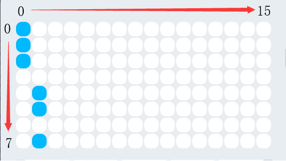

:mod:`display` --- 表情面板
=============================================

.. module:: display
   :synopsis: 表情面板

``display`` 模块的主要功能与函数

表情面板显示说明
----------------------

如上图所示，表情面板以左上角为坐标 0 点， x ，y 的方向如箭头示意。
显示图片参数时，以上图为例，其第一列数据中上面三个是点亮的，在数据转换时，这个数据转换为
``11100000``， 即 16进制 0xe0，第二列诗句转换为 ``00001101``，即 16进制的 0x0d，上图
的全部点阵转换为图片参数时，是 ``e00d0000000000000000000000000000``。

功能相关函数
----------------------

.. function:: show_image(image, pos_x = 0, pos_y = 0, time_s = None)

   以图片参数的方式显示自定义的点阵图形, 参数：

  - *image* 字符串数据，点阵的每一列有8个显示点，为1 byte的数据,转换为16进制的字符串。
    因此16列点阵，需要用 32 个字符串数据来表示。
  - *pos_x* 显示图形在表情面板上x轴的偏移量，参数范围是 ``-15 ~ 15``，如果不设置该参数，默认从 0位置开始。
  - *pos_y* 显示图形在表情面板上y轴的偏移量，参数范围是 ``-7 ~ 7``，如果不设置该参数，默认从 0位置开始。
  - *time_s* 显示暂留的时间(以秒为单位)，如果没有设置该参数，在有清屏或者重新设置表情面板操作之前，维持显示不变。

.. function:: show(var, pos_x = 0, pos_y = 0, wait = True)

    以全类型的数据参数方式显示数据，参数：

  - *var* 全类型， 其中数值型和时间类型的显示会做特殊处理，时间格式显示需满足："[x]x:[x]x"格式
    (正则表达式 "\d?\d:\d\d?")
  - *pos_x* 显示数据在表情面板上x轴的偏移量，参数范围是 ``-15 ~ 15``，如果不设置该参数，默认从 0位置开始。
  - *pos_y* 显示数据在表情面板上y轴的偏移量，参数范围是 ``-7 ~ 7``，如果不设置该参数，默认从 0位置开始。
  - *wait* 设置是否阻塞显示，其中 ``True``：表示阻塞直到显示完毕， ``False``：表示显示但不阻塞。

.. function:: set_pixel(pos_x, pos_y, status)

    设置表情面板单个像素点的亮灭状态，参数：

  - *pos_x* 像素点在表情面板上x轴的坐标，参数范围是 ``0 ~ 15``。
  - *pos_y* 像素点在表情面板上y轴的坐标，参数范围是 ``0 ~ 7``。
  - *status* 布尔值，其中 ``True``：表示像素点亮， ``False``：表示像素熄灭。

.. function:: get_pixel(pos_x, pos_y)

    获得表情面板上单个像素点当前的亮灭状态，返回值是布尔值，其中 ``True``：表示像素点亮， ``False``：表示像素熄灭。
    参数：

  - *pos_x* 像素点在表情面板上x轴的坐标，参数范围是 ``0 ~ 15``。
  - *pos_y* 像素点在表情面板上y轴的坐标，参数范围是 ``0 ~ 7``。

.. function:: toggle_pixel(pos_x, pos_y)

    切换表情面板上单个像素点当前的亮灭状态。参数：

  - *pos_x* 像素点在表情面板上x轴的坐标，参数范围是 ``0 ~ 15``。
  - *pos_y* 像素点在表情面板上y轴的坐标，参数范围是 ``0 ~ 7``。

.. function:: clear()

    熄灭表情面板上全部的灯。

程序示例：
----------------------

.. code-block:: python

  import codey
  import time
  
  codey.display.show("ffffff")
  codey.display.show("123")
  time.sleep(1)
  codey.display.show("12345", 3, 1)
  codey.display.set_pixel(True, 1, 1)
  image = "ffffffffff000000000000000000000000"
  codey.display.show_image(image, pos_x = 3, pos_y = 4)
  time.sleep(1)
  codey.display.clear()
  codey.display.animation(1, True)
  print("[1, 1]:", codey.display.get_pixel(1, 1))
  codey.display.show("12:28")
  while True:
      codey.display.toggle_pixel(7, 2)
      codey.display.toggle_pixel(7, 4)
      time.sleep(1)
