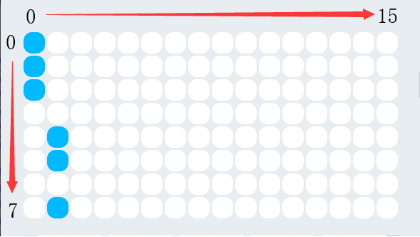

:mod:`display` --- Face Panel
=============================================

.. module:: display
    :synopsis: Face Panel

The main functionality and function of the ``display`` module

Face Panel Explanation
----------------------

As shown in the figure above, the face panel has the upper left corner as the coordinate 0 point, and the direction of x and y is indicated by the arrow. About parameters displayed, take above figure as an example. The upper three of the first column data are lit and the data is converted to ``11100000``, that is, hexadecimal 0xe0.The second column verse is converted to ``00001101``, that is, In hexadecimal 0x0d. All the lattices in the above figure are converted to ``e00d0000000000000000000000000000``.

Function
----------------------

.. function:: show_image(image, pos_x = 0, pos_y = 0, time_s = None)

   Display custom dot matrix graphics as image parameters, parameters：

    - *image* string data, each column of the dot matrix has 8 display points, which is 1 byte of data, converted to a hexadecimal string. Therefore, 16 columns of lattices need to be represented by 32 string data.
    - *pos_x* displays the offset of the x-axis of the graph on the panel. The parameter range is ``-15 ~ 15``, It starts from the 0 position as default if this parameter is not set.
    - *pos_y* displays the offset of the graph on the y-axis of the panel. The parameter range is ``-7 ~ 7``, It starts from the 0 position as default if this parameter is not set.
    - *time_s* displays the time in seconds (in seconds). If this parameter is not set, the display remains unchanged until there is a clear screen or resetting the panel operation.

.. function:: show(var, pos_x = 0, pos_y = 0, wait = True)

   Display data in full-type data parameters, parameters：

    - *var* full type, where the display of numeric and time types is treated specially, and the time format display needs to satisfy: ``[x]x:[x]x`` format (regular expression ``d?d:dd?``)
    - *pos_x* displays the offset of the data on the x-axis of the panel. The parameter range is ``-15 ~ 15``. It starts from the 0 position as default if this parameter is not set.
    - *pos_y* displays the offset of the data on the y-axis of the panel. The parameter range is ``-7 ~ 7``. It starts from the 0 position as default if this parameter is not set.
    - *wait* sets whether to block the display, where ``True``: means blocking until the display is complete, ``False``: means display but not blocking.

.. function:: set_pixel(pos_x, pos_y, status)

   Set the brightness and deactivation status of a single pixel of the panel, Parameters：

    - *pos_x* The coordinates of the x-axis for the pixel on the panel. The parameter range is ``0 ~ 15``.
    - *pos_y* The coordinates of the y-axis for the pixel on the panel. The parameter range is ``0 ~ 7``.
    - *status* Boolean value，where ``True`` indicates that the pixel is lit, and ``False``: indicates that the pixel is off.

.. function:: get_pixel(pos_x, pos_y)

   Get the current on and off states of a single pixel on the panel. The return value is a Boolean value, where ``True``: indicates that the pixel is lit, and ``False``: indicates that the pixel is off, parameter：

    - *pos_x* The coordinates of the x-axis for the pixel on the panel. The parameter range is ``0 ~ 15``.
    - *pos_y* The coordinates of the y-axis for the pixel on the panel. The parameter range is ``0 ~ 7``.

.. function:: toggle_pixel(pos_x, pos_y)

   Toggle the current on and off states of a single pixel on the panel, parameter：

    - *pos_x* The coordinates of the x-axis for the pixel on the panel. The parameter range is ``0 ~ 15``.
    - *pos_y* The coordinates of the y-axis for the pixel on the panel. The parameter range is ``0 ~ 7``.

.. function:: clear()

   Turn off all the LED lights on the display.

Sample Code：
----------------------

.. code-block:: python

  import codey
  import time
  
  codey.display.show("ffffff")
  codey.display.show("123")
  time.sleep(1)
  codey.display.show("12345", 3, 1)
  codey.display.set_pixel(1, 1, True)
  image = "ffffffffff000000000000000000000000"
  codey.display.show_image(image, pos_x = 3, pos_y = 4)
  time.sleep(1)
  codey.display.clear()
  print("[1, 1]:", codey.display.get_pixel(1, 1))
  codey.display.show("12:28")
  while True:
      codey.display.toggle_pixel(7, 2)
      codey.display.toggle_pixel(7, 4)
      time.sleep(1)
