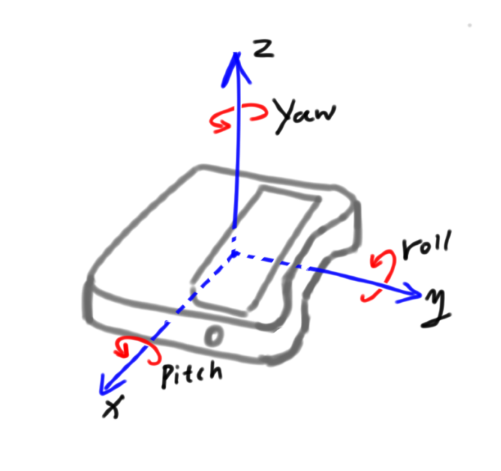

:mod:`motion_sensor` --- Onboard Motion Sensor
=============================================

.. module:: motion_sensor
    :synopsis: Onboard Motion Sensor

The main functionality and function of the ``motion_sensor`` module

Motion sensor description
----------------------

As shown in the picture above, the direction of the roll and pitch are based on the right-handed screw rule.

Both roll and pitch are ``0°`` when the Codey is horizontally placed.

Roll range: ``-90° ~ 90°``

Pitch range: ``-180 ° ~ 180 °``

Function
----------------------

.. function:: get_roll()

   Get the roll of the Euler angle, the returned data range is ``-90 ~ 90``.

.. function:: get_pitch()

   Get the pitch of the Euler angle, the returned data range is ``-180 ~ 180``.

.. function:: get_yaw()

   Get the yaw of the Euler angle. The returned data range is ``0 ~ 360``. Since the Codey onboard sensor is a six-axis sensor, there is no electronic compass. So in fact the yaw angle is just the integral of the Z-axis angular velocity. It has accumulated errors. If you want to get a true yaw angle, this API is not suitable for use.

.. function:: get_rotation(axis)

   Get the angle at which the Codey rotates on the three axes, and the counterclockwise direction is the positive direction, parameter：

    - *axis* String type, with ``x``, ``y``, ``z`` representing the axis defined by Codey.

.. function:: reset_rotation(axis = "all")

   The current angle of initial rotation around the three axes is 0, and the ``get_rotation()`` will start at 0, parameter:

    - *axis* string type, with ``x``, ``y``, ``z`` representing the axis defined by Codey, and ``all`` representing all three axes. This is also the default value for this function.

.. function:: is_shaked()

   Check if the Codey is shaken, the return value is a Boolean value, where ``True`` means that Codey is shaken, and ``False`` means that Codey is not shaken.

.. function:: get_shake_strength()

   If the Codey is shaken, this function can obtain the intensity of the shaking. The value of the return value range is ``0 ~ 100``. The larger the value, the greater the intensity of the shaking.

.. function:: is_tilted_left()

   Check if Codey is tilted to the left, and the return value is a Boolean value, where ``True`` means that Codey is tilted to the left, and ``False`` means that Codey is not tilted to the left.

.. function:: is_tilted_right()

   Check if Codey is tilted to the right, and the return value is a Boolean value, where ``True`` means that Codey is tilted to the right, and ``False`` means that Codey is not tilted to the right.

.. function:: is_ears_up()

   Check if the ear of Codey is up, the return value is a Boolean value, where ``True`` means that the ear of Codey is facing up, and ``False`` means that the ear of Codey is not facing up.

.. function:: is_ears_down()

   Check if the ear of Codey is down, the return value is a Boolean value, where ``True`` means that the ear of Codey is facing down, and ``False`` means that the ear of Codey is not facing down.

.. function:: is_display_up()

   Check if the face panel of Codey is up, the return value is a Boolean value, where ``True`` means that the panel of Codey is facing up, and ``False`` means that the panel of Codey is not facing up.

.. function:: is_display_down()

   Check if the face panel of Codey is down, the return value is a Boolean value, where ``True`` means that the panel of Codey is facing down, and ``False`` means that the panel of Codey is not facing down.

.. function:: is_upright()

   Check if Codey is upright, the return value is a Boolean value, where ``True`` means that Codey is upright, and ``False`` means that Codey is not upright.

.. function:: get_acceleration(axis)

   Get the acceleration values of the three axes in ``m/s^2``, Parameters：

   - *axis* String type, with ``x``, ``y``, ``z`` representing the axis defined by Codey.

.. function:: get_gyroscope(axis)

   Get the angular velocity values of the three axes in ``°/sec``, Parameters：

   - *axis* String type, with ``x``, ``y``, ``z`` representing the axis defined by Codey。

Sample Code 1：
----------------------

.. code-block:: python

  import codey
  import time
  
  while True:
      roll = codey.motion_sensor.get_roll()
      pitch = codey.motion_sensor.get_pitch()
      yaw = codey.motion_sensor.get_yaw()
      print("roll:", end = "")
      print(roll, end = "")
      print("   ,pitch:", end = "")
      print(pitch, end = "")
      print("   ,yaw:", end = "")
      print(yaw)
      time.sleep(0.05)

Sample Code 2：
----------------------

.. code-block:: python

  import codey
  
  while True:
      if codey.motion_sensor.is_shaked():
          print("shake_strength:", end = "")
          print(codey.motion_sensor.get_shake_strength())

Sample Code 3：
----------------------

.. code-block:: python

  import codey
  
  while True:
      if codey.motion_sensor.is_tilted_left():
          print("tilted_left")
      if codey.motion_sensor.is_tilted_right():
          print("tilted_right")
      if codey.motion_sensor.is_ears_up():
          print("ears_up")
      if codey.motion_sensor.is_ears_down():
          print("ears_down")
      if codey.motion_sensor.is_display_up():
          print("display_up")
      if codey.motion_sensor.is_display_down():
          print("display_down")
      if codey.motion_sensor.is_upright():
          print("upright")