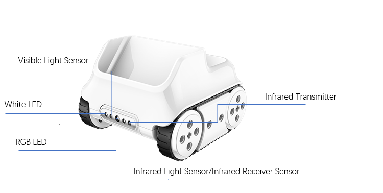

:mod:`color_ir_sensor` --- 颜色红外传感器
=============================================

.. module:: color_ir_sensor
   :synopsis: 颜色红外传感器

``color_ir_sensor`` 模块的主要功能与函数

颜色红外传感器说明
----------------------

如图所示，小奔前方的传感器分别为

- 白光 LED：发出白光，配合可见光传感器可以探测物体表面的可见光反射强度。
- 可见光光线传感器：探测可见光的强度。
- RGB LED：按照特定RGB数值发出光线，配合可见光传感器识别颜色。
- 红外光光线传感器：探测红外光线的强度。
- 红外发射器：发射红外光线，配合红外光光线传感器可以探测物体表面的红外光反射强度。

功能相关函数
----------------------

.. function:: get_red()

   获取颜色传感器的红色色值分量的大小，参数范围是 ``0 ~ 100``。

.. function:: get_green()

   获取颜色传感器的绿色色值分量的大小，参数范围是 ``0 ~ 100``。

.. function:: get_blue()

   获取颜色传感器的蓝色色值分量的大小，参数范围是 ``0 ~ 100``。

.. function:: is_color(color_str)

   判断是否检测到匹配的颜色，参数：

    - *color_str* 颜色类型，包括 ``红、绿、蓝、黄、青、紫、白、黑``，对应的参数是
      ``red``、``green``、``blue``、``yellow``、``purple``、``cyan``、``white``、``black``，
      返回数值为布尔值，``Ture`` 为颜色匹配，``False`` 为颜色不匹配。

.. function:: get_light_strength()

   获取可见光传感器的检测到的环境光强度，数值范围 ``0 ~ 100``。

.. function:: get_greyness()

   获取可见光传感器的检测到的灰度值（使用RGB和可见光传感器），数值范围 ``0 ~ 100``。

.. function:: get_reflected_light()

   获取可见光传感器的检测到的可见光反射强度（使用白灯和可见光传感器），数值范围 ``0 ~ 100``。

.. function:: get_reflected_infrared()

   获取红外光接收管检测到的红外光反射强度，数值范围 ``0 ~ 100``。

.. function:: is_obstacle_ahead()

   检测前方是否有障碍物，返回值为布尔值，``Ture`` 为有障碍物，``False`` 为没有障碍物。

.. function:: set_led_color(color_name)

   设置颜色传感器中 RGB LED灯的颜色： 参数：

   - *color_name* 包括 ``红、绿、蓝、黄、青、紫、白、黑``，对应的参数是
     ``red``、``green``、``blue``、``yellow``、``purple``、``cyan``、``white``、``black``，

程序示例：
------------

.. code-block:: python

  import codey
  import rocky
  
  while True:
      if rocky.color_ir_sensor.is_obstacle_ahead():
          rocky.color_ir_sensor.set_led_color('white')
      else:
      	rocky.color_ir_sensor.set_led_color('black')  