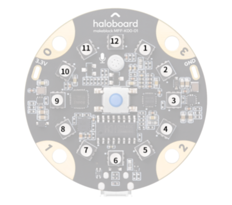

:mod:`led` --- 板载全彩LED灯
=============================================

.. module:: led
    :synopsis: 板载全彩LED灯

``led`` 模块的主要功能与函数

功能相关函数
----------------------

.. function:: show_single(led_id, r, g, b)

  设置单颗RGB LED灯的颜色，参数：
- *led_id*  单颗LED的编号，参数范围是1-12，对应位置如下图：

- *r* 全彩LED红色分量的数值，参数范围是 0 ~ 255， 0为无红色分量，255是红色分量最亮。
- *g* 全彩LED绿色分量的数值，参数范围是 0 ~ 255， 0为无绿色分量，255是绿色分量最亮。
- *b* 全彩LED蓝色分量的数值，参数范围是 0 ~ 255， 0为无蓝色分量，255是蓝色分量最亮。

  常用颜色RGB对应表：
    .. image:: img/2.png

.. function:: show_all(r, g, b)

  设置所有RGB LED灯为相同的颜色。

- *r* 全彩LED红色分量的数值，参数范围是 0 ~ 255， 0为无红色分量，255是红色分量最亮。
- *g* 全彩LED绿色分量的数值，参数范围是 0 ~ 255， 0为无绿色分量，255是绿色分量最亮。
- *b* 全彩LED蓝色分量的数值，参数范围是 0 ~ 255， 0为无蓝色分量，255是蓝色分量最亮。

.. function:: off_all()

  熄灭所有LED灯。

.. function:: clear()

  熄灭所有LED灯，并打开灭灯标志 。

.. function:: off_single(led_id)

  熄灭单颗RGB LED，参数：
- *led_id* 单颗LED的编号，参数范围是1-12。

.. function:: show_ring(color_str, offset=0)

  同时设置12颗RGB LED为相应的颜色，参数：
- *color_str* 字符串类型，字符串格式需满足“color1 color2 color3 color4”，
  其中colorx为"red"/"green"/"blue"/"yellow"/"cyan"/"purple"/"white"/"orange"/"black/"gray"颜色字符以单个空格隔开，
  当颜色个数大于12时将被截断成12个。
- *offset* 数值型，数值范围0-12。

.. function:: ring_graph(percentage)

  用LED灯环的状态显示百分比，参数：
- *percentage* 数值型，数值范围0-100。

.. function:: meteor_effect()

  显示meteor灯效 。

.. function:: rainbow_effect()

  显示rainbow灯效 。
  
.. function:: spoondrift_effect()

  显示spoondrift灯效 。
    
.. function:: firefly_effect()

  显示firefly灯效 。
  
.. function:: show_animation(name)

  显示默认灯效，阻塞型，参数：
- *name* 默认灯效名，有四种：spoondrift, meteor, rainbow, firefly。

程序示例一：
----------------------

.. code-block:: python

	import haloboard
	import time

	haloboard.led.show_single(1, 255, 255,255)
	time.sleep(2)
	haloboard.led.show_single(2, 255, 0, 0)
	time.sleep(2)
	haloboard.led.show_single(3, 0, 255, 0)
	time.sleep(2)
	haloboard.led.show_single(4, 0, 0, 255)
	time.sleep(2)
	haloboard.led.show_all(255, 255, 255)
	time.sleep(2)
	while True:
	    haloboard.led.off_single(1)
	    time.sleep(1)
	    haloboard.led.show_single(1, 255, 0, 0)
	    time.sleep(1)

程序示例二：
----------------------

.. code-block:: python

  import haloboard
  import time

  haloboard.led.show_single(1, 255, 255,255)
  time.sleep(2)
  haloboard.led.show_single(2, 255, 0, 0)
  time.sleep(2)
  haloboard.led.show_single(3, 0, 255, 0)
  time.sleep(2)
  haloboard.led.show_single(4, 0, 0, 255)
  time.sleep(2)
  haloboard.led.show_all(255, 255, 255)
  time.sleep(2)
  while True:
      haloboard.led.off_single(1)
      time.sleep(1)
      haloboard.led.show_single(1, 255, 0, 0)
      time.sleep(1)

程序示例三：
----------------------

.. code-block:: python

  import haloboard 
  import time
  import random

  while True:
      for i in range(101):
          haloboard.led.ring_graph(i)
          time.sleep(0.1)
          print(i)

      for i in range(101):
          haloboard.led.ring_graph(100 - i)
          time.sleep(0.1)
          print(i)

      for i in range(13):
          haloboard.led.show_ring("green blue yellow purple cyan white green blue yellow purple cyan white", i)
          time.sleep(0.5)

程序示例四：
----------------------

.. code-block:: python

  import haloboard
  import time
  import event

  @event.touchpad0_active
  def on_touchpad0_active():
      haloboard.stop_other_scripts()
      while True:
          haloboard.led.show_animation('spoondrift')

  @event.touchpad1_active
  def on_touchpad1_active():
      haloboard.stop_other_scripts()
      while True:
          haloboard.led.show_animation('meteor')

  @event.touchpad2_active
  def on_touchpad2_active():
      haloboard.stop_other_scripts()
      while True:
          haloboard.led.show_animation('rainbow')

  @event.touchpad3_active
  def on_touchpad3_active():
      haloboard.stop_other_scripts()
      while True:
          haloboard.led.show_animation('firefly')
