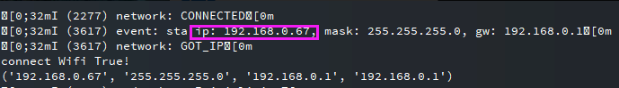
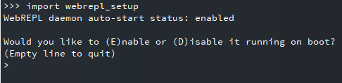
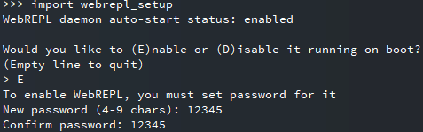
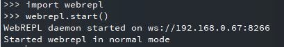
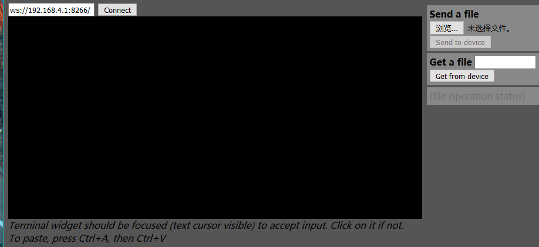
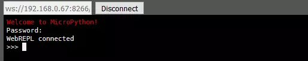
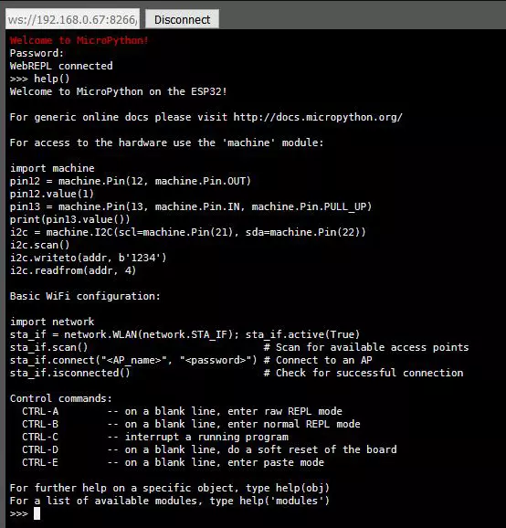
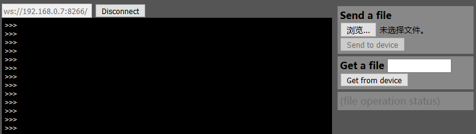

.. __haloboard_tutorial_webrepl_index:

Open and connect the webrepl in Haloboard
=============================================

Webrepl is micropython's management platform for providing wireless connectivity.

Step 1：Burn down firmware
       Make sure your firmware is ready.

Step 2：Connect to the network
			 Open the serial assistant (such as putty, secureCRT, etc.), use USB to connect the haloboard and the computer. Press CTRL +e to enter the code paste mode.(Note: ssid is the name of WiFi, password is the password of WiFi)

.. code-block:: python

	import network
	import time 
	ssid=''
	password=''
	wlan=network.WLAN(network.STA_IF)
	wlan.active(True)
	wlan.connect(ssid,password)
	i=0

	while(wlan.ifconfig()[0]=='0.0.0.0' and i < 100):
	    i=i+1
	    time.sleep(1)
	    if(wlan.ifconfig()[0]=='0.0.0.0'):
	        print('connect Wifi False!')
	        #return False
	    else:
	        print('connect Wifi True!')
	        print(wlan.ifconfig())
	        #return True

As shown in the figure above, the network configuration is completed and the IP address of the module is output.

Step 3：Configuration webrepl
	1.Input to the serial port
.. code-block:: python

	import webrepl_setup

As shown in the figure above, input to the serial port: import webrepl_setup.

	2.Enter E to confirm the opening of webrepl, and enter the password twice continuously to complete the configuration

As shown in the figure above, enter the password twice.

	3.Manual input: import webrepl and webrepl.start() ，open webrepl

As shown in the figure above, open webrepl.

Step 4：Connect webrepl
	1.Open the webrepl network address：http://micropython.org/webrepl/

As shown in the figure above, webrepl UI.

    2.Enter the IP address in step 3, click Connect, and enter the password (Note: the password is not displayed when entering!).

As shown in the figure above, interface successfully connected.

    3.You can try this by typing help()

Step 5：Configure boot connection WiFi and turn on webrepl
	1.New boot.py，as follow:
.. code-block:: python

	import time    

	ssid=''
	password=''

	def connectWifi():
	    wlan=network.WLAN(network.STA_IF)                     #create a wlan object
	    wlan.active(True)                                     #Activate the network interface
	    wlan.connect(ssid,password)   
	    i=0
	    while(wlan.ifconfig()[0]=='0.0.0.0' and i < 10):
	        i=i+1
	        time.sleep(1)
	        if(wlan.ifconfig()[0]=='0.0.0.0'):
	            print('connect Wifi False!')
	            return False
	        else:
	            print('connect Wifi True!')
	            print(wlan.ifconfig())
	            return True          
	if(connectWifi() == True):
	    import webrepl
	    webrepl.start()
Note: fill in the ssid and password of the code above.

	2.Back to the website interface of webrepl, click browse under "Send a file" in the right column, select boot.py just written, click "Send to device", and wait for the upload to complete

As shown in the figure above, send a file.

	3.Enter CTRL +d or restart Haloboard without power. Connect again after the restart.
  		At this point in the open webrepl website can be managed haloboard, rather than a serial line.
