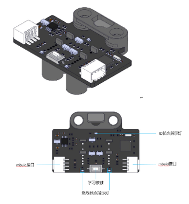

:mod:`dual_rgb_sensor` --- 双路RGB传感器
=============================================

.. module:: dual_rgb_sensor
    :synopsis: 双路RGB传感器

``dual_rgb_sensor`` 模块的主要功能与函数

双路RGB传感器说明
----------------------

双路RGB传感器模块外观如下图所示：

功能相关函数
----------------------

.. function:: get_intensity(ch)

   获取探头光强值，返回的数据范围是 ``0 ~ 255``

    - *ch* 通道号，字符串类型，通道范围：

        ``"RGB1"`` ：通道1

        ``"RGB2"`` ：通道2

.. function:: is_state(state)

   巡线时，获取RGB1|RGB2的状态，如果获取到的状态等于state，则返回 ``True`` ，否则返回 ``False``。

    - *state* 字符串类型，参数范围：

        ``"00"`` ：RGB1在线上，RGB2在线上

        ``"01"`` ：RGB1在线上，RGB2在轨道上

        ``"10"`` ：RGB1在轨道上，RGB2在线上

        ``"11"`` ：RGB1在线轨道上，RGB2在轨道上

.. function:: get_offset_track_value()

   在巡线时，获取传感器偏离轨道值，返回数据范围 ``-100 ~ 100``

.. function:: is_color(ch，color)

   获取颜色值的状态，如果获取到的颜色等于color，则返回 ``True`` ，否则返回 ``False``。

    - *ch* 通道号，字符串类型，通道范围：

        ``"RGB1"`` ：通道1

        ``"RGB2"`` ：通道2
    - *color* 颜色，字符串类型，可以选择的颜色有：

        "white"： 白色

        "puple": 紫色

        "red": 红色

        "yellow": 黄色

        "green": 绿色

        "cyan": 青色

        "blue": 蓝色

        "black": 黑色

.. function:: set_led_color(color)

   设置巡线时使用的颜色

    - *color* 颜色，字符串类型，可以选择的颜色有 ``red``，``green``，``blue``。

.. function:: is_on_track(ch)

   巡线时，获取RGB探头状态，如果RGB探头在轨道上，则返回 ``True`` ，否则返回 ``False``

    - *ch* 通道号，字符串类型，通道范围：

        ``"RGB1"`` ：通道1

        ``"RGB2"`` ：通道2

.. function:: is_on_background(ch)

   巡线时，获取RGB探头状态，如果RGB探头在背景上，则返回 ``True`` ，否则返回 ``False``

    - *ch* 通道号，字符串类型，通道范围：

        ``"RGB1"`` ：通道1

        ``"RGB2"`` ：通道2

.. function:: set_motor_diff_speed_kp(kp)

   巡线时，设置传感器偏离轨道的电机差速系数，参数：

    - *kp* 系数，范围： ``0 ~ 1``。

.. function:: get_motor_diff_speed()

   在巡线时，获取传感器偏离轨道的电机差速，返回值等于传感器偏离轨道值get_offset_track_value()乘于设置的电机差速系数kp。

程序示例1-巡线：
----------------------

.. code-block:: python

  import novapi
  from mbuild.dual_rgb_sensor import dual_rgb_sensor_class
  from mbuild.encoder_motor import encoder_motor_class

  __dual_rgb_1 = dual_rgb_sensor_class("PORT1", "INDEX1")
  __encoder_motor_1 = encoder_motor_class("M1", "INDEX1")
  __encoder_motor_2 = encoder_motor_class("M2", "INDEX1")

  speed = 50
  __dual_rgb_1.set_motor_diff_speed_kp(0.5)

  while True:
      __encoder_motor_1.set_power(speed + __dual_rgb_1.get_motor_diff_speed())
      __encoder_motor_2.set_power(speed - __dual_rgb_1.get_motor_diff_speed())
      time.sleep(0.01)

程序示例2-识别颜色：
----------------------

.. code-block:: python

  import novapi
  from mbuild.dual_rgb_sensor import dual_rgb_sensor_class

  __dual_rgb_1 = dual_rgb_sensor_class("PORT1", "INDEX1")

  while True:
      if __dual_rgb_1.is_color("RGB1", "red"):
          print("RGB1 color is red")
      if __dual_rgb_1.is_color("RGB2", "red"):
          print("RGB2 color is red")
      time.sleep(0.01)

程序示例3-检测"RGB1|RGB2"状态：
----------------------

.. code-block:: python

  import novapi
  from mbuild.dual_rgb_sensor import dual_rgb_sensor_class

  __dual_rgb_1 = dual_rgb_sensor_class("PORT1", "INDEX1")

  while True:
      if __dual_rgb_1.is_state("00"):
          print("RGB1|RGB2 is：00")
      elif __dual_rgb_1.is_state("01"):
          print("RGB1|RGB2 is：01")
      elif __dual_rgb_1.is_state("10"):
          print("RGB1|RGB2 is：10")
      elif __dual_rgb_1.is_state("11"):
          print("RGB1|RGB2 is：11")
      time.sleep(0.01)

