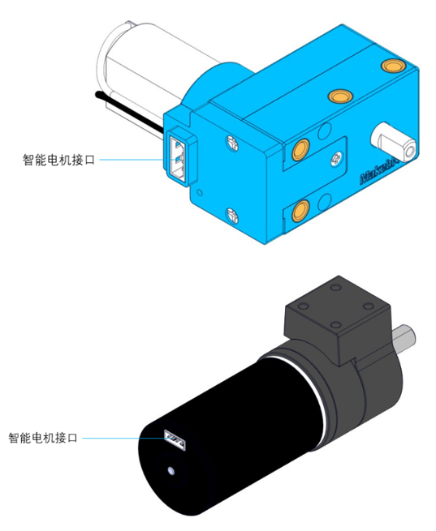

:mod:`encoder_motor` --- 编码电机
=============================================

.. module:: encoder_motor
    :synopsis: 编码电机

``encoder_motor`` 模块的主要功能与函数

编码电机说明
----------------------

编码电机包括180编码电机和36堆叠无刷电机模块外观如下图所示：

功能相关函数
----------------------

.. function:: move_to(position, speed)

   按指定转速移动到绝对角度，参数：

    - *position* 目标角度，单位为度，范围 ``-2147483648~2147483647``
    - *speed* 转速，单位为rpm/min，范围 ``不限定``

.. function:: move(position, speed)

   按指定转速移动到相对角度，参数：

    - *position* 目标角度，单位为度，范围 ``-2147483648~2147483647``
    - *speed* 转速，单位为rpm/min，范围 ``不限定``

.. function:: set_speed(speed)

   设置目标速度，闭环控制，参数：

    - *speed* 转速，单位为rpm/min，范围：不限制，以电机最大能力转动。

.. function:: set_power(pwm)

   设置电机以指定动力转动，开环控制，参数：

    - *pwm* 转速，单位为 ``无``，范围 ``-100~100``。

.. function:: get_value(type)

   获取电机数据，参数：

    - *type* 获取数据类型，字符串类型，参数可以选择为：

      “angle”：当前位置角度，返回值单位为读

      “speed”：当前速度，返回值单位为rpm/min

程序示例：
------------

.. code-block:: python

  import novapi
  from mbuild.encoder_motor import encoder_motor_class

  #先初始化，定义电机接在M1口的第1个
  __encoder_motor_1 = encoder_motor_class("M1", "INDEX1")

  while True:
      __encoder_motor_1.set_power(50)
      __encoder_motor_1.set_power(-50)
      time.sleep(1)

      __encoder_motor_1.set_speed(100)
      __encoder_motor_1.set_speed(-100)
      time.sleep(1)

      __encoder_motor_1.move_to(360, 100)
      __encoder_motor_1.move_to(-360, 100)
      time.sleep(1)

      __encoder_motor_1.move(360, 100)
      __encoder_motor_1.move(-360, 100)
      time.sleep(1)

      __encoder_motor_1.set_power(50)
      time.sleep(1)
      speed = __encoder_motor_1.get_value("speed")
      print("speed: %d" %speed)
      position1 = __encoder_motor_1.get_value("angle")
      print("position1: %d" %position1)