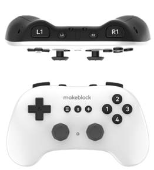

:mod:`gamepad` --- 遥控手柄
=============================================

.. module:: gamepad
    :synopsis: 遥控手柄

``gamepad`` 模块的主要功能与函数

遥控手柄说明
----------------------

遥控手柄外观如下图所示：

功能相关函数
----------------------

.. function:: get_joystick(joystick_pos)

   获取摇杆值，返回值范围 ``100 ~ -100`` ，左正右负，上正下负，参数：

    - *joystick_pos* 字符串类型，其中：

      “Lx”：左边x轴

      “Ly”：左边y轴

      “Rx”：右边x轴

      “Ry”：右边y轴

.. function:: s_key_pressed(button)

   判断手柄按键是否被按下，返回值是布尔值，其中 ``True`` 表示按键被按下， ``False`` 按键未被按下

    - *button* 字符串类型，其中：

      “R1”：右边R1
  
      “R2”： 右边R2
  
      “L1”： 左边L1
  
      “L2”： 左边L2
  
      “N1”： 数字1
  
      “N2”： 数字2
  
      “N3”： 数字3
  
      “N4”： 数字4
  
      “Up”： 方向键上
  
      “Down“： 方向键下
  
      “Left“： 方向键左
  
      “Right”： 方向键右
  
      “Start”： 开始键
  
      “Select“： 菜单键
  
      “L_Thumb”： 左边摇杆按下
      
      “R_Thumb“： 右边摇杆按下

程序示例：
----------------------

.. code-block:: python

  import novapi
  from mbuild import gamepad

  while True:
      time.sleep(0.1)
      if(gamepad.is_key_pressed("Up")):
          print("Up")
      elif(gamepad.is_key_pressed("Down")):
          print("Down")  
      elif(gamepad.is_key_pressed("Left")):
          print("Left")  
      elif(gamepad.is_key_pressed("Right")):
          print("Right")    
      elif(gamepad.is_key_pressed("N1")):
          print("N1")       
      elif(gamepad.is_key_pressed("N2")):
          print("N2")  
      elif(gamepad.is_key_pressed("N3")):
          print("N3")  
      elif(gamepad.is_key_pressed("N4")):
          print("N4")  
      elif(gamepad.is_key_pressed("L1")):
          print("L1")  
      elif(gamepad.is_key_pressed("L2")):
          print("L2")  
      elif(gamepad.is_key_pressed("R1")):
          print("R1")       
      elif(gamepad.is_key_pressed("R2")):
          print("R2")  
      elif(gamepad.is_key_pressed("Start")):
          print("Start") 
      elif(gamepad.is_key_pressed("Select")):
          print("Select")
      elif(gamepad.is_key_pressed("L_Thumb")):
          print("L_Thumb") 
      elif(gamepad.is_key_pressed("R_Thumb")):
          print("R_Thumb") 
      else:
          Lx = gamepad.get_joystick("Lx")
          Ly = gamepad.get_joystick("Ly")
          Rx = gamepad.get_joystick("Rx")
          Ry = gamepad.get_joystick("Ry")
          print("Lx=%d, Ly=%d, Rx=%d, Ry=%d, " % (Lx, Ly, Rx, Ry))