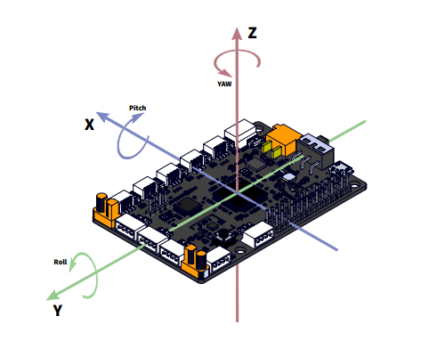

:mod:`gyro_sensor` --- 板载陀螺仪传感器
=============================================

.. module:: gyro_sensor
    :synopsis: 板载陀螺仪传感器

``gyro_sensor`` 模块的主要功能与函数

板载陀螺仪传感器说明
----------------------

板载陀螺仪的坐标体系如下图所示：

功能相关函数
----------------------

.. function:: get_pitch()

   获取姿态角的俯仰角(X轴)，单位：°，返回的数据范围是 ``-180 ~ 180``

.. function:: get_roll()

   获取姿态角的翻滚角(Y轴)，单位：°，返回的数据范围是 ``-180 ~ 180``

.. function:: get_yaw()

   获取姿态角的偏航角(Z轴)，单位：°，返回的数据范围是 ``-32768 ~ 32767``，由于板载的陀螺仪模块是六轴传感器，没有电子罗盘。 所以实际上偏航角只是使用了Z轴角速度的积分。它存在着积累误差。如果是想获得真实偏航角的，这个API不适合使用。

.. function:: is_shaked()

   检测板载陀螺仪模块是否有被摇晃，返回值是布尔值，其中 ``True`` 表示陀螺仪模块被晃动了，``False`` 表示陀螺仪模块未被晃动。

.. function:: get_acceleration(axis)

   获取三个轴的加速度值，单位是 ``g``，参数：

    - *axis* 字符串类型，以 ``x``，``y``，``z`` 代表板载陀螺仪模块定义的坐标轴。

.. function:: get_gyroscope(axis)

   获取三个轴的角速度值，单位是 ``°/秒``，返回的数据范围是 ``-500 ~ 500``，参数：

    - *axis* 字符串类型，以 ``x``，``y``，``z`` 代表板载陀螺仪模块定义的坐标轴。

.. function:: set_shake_threshold(threshold)

   设置震动阈值，参数：

    - *threshold* 震动阈值，范围是``0~100``，系统默认震动阈值为50，0表示关闭震动检测。

.. function:: reset_rotation(axis)

   重置绕x、y、z轴转过的角度，参数：

    - *axis* 字符串类型，以 ``x``，``y``，``z``，``all`` 代表板载陀螺仪模块定义的坐标轴，``all`代表所有轴。

程序示例1：
------------

.. code-block:: python

  import novapi
  
  while True:
      print("pitch:", novapi.get_pitch())
      print("roll:", novapi.get_roll())
      print("yaw:", novapi.get_yaw())

程序示例2：
------------

.. code-block:: python

  import novapi
  
  while True:
      print("x acc:", novapi.get_acceleration("x"))
      print("y acc:", novapi.get_acceleration("y"))
      print("z acc:", novapi.get_acceleration("z"))

程序示例3：
------------

.. code-block:: python

  import novapi
  
  while True:
      print("x gyro:", novapi.get_gyroscope("x"))
      print("y gyro:", novapi.get_gyroscope("y"))
      print("z gyro:", novapi.get_gyroscope("z"))

程序示例4：
------------

.. code-block:: python

  import novapi
  
  novapi.set_shake_threshold(60)
  
  while True:
      if novapi.is_shaked():
          print("novapi is shaked")