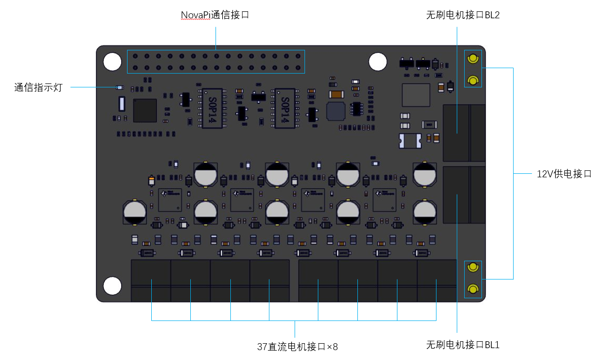

:mod:`power_expand_board` --- 动力扩展板
=============================================

.. module:: power_expand_board
    :synopsis: 动力扩展板

``power_expand_board`` 模块的主要功能与函数

动力扩展板说明
----------------------

动力扩展板外观如下图所示：

功能相关函数
----------------------

.. function:: set_power(ch, pwm)

   设置直流电机以指定动力转动，开环控制，参数：

    - *ch* 通道，直流电机通道/电磁阀通道为 ``"CH1" ~ "CH8"``, 无刷电机通道为 ``"BL1" ~ "BL2"``。

    - *pwm* 转速，单位为 ``无``，范围 ``-100~100``， 当设置电磁阀断电时pwn为0，当设置电磁阀通电时pwm为100。

.. function:: stop(ch)

   使直流电机/无刷电机停止运转，参数：

    - *ch* 通道，直流电机通道为 ``"CH1" ~ "CH8"``, 无刷电机通道为 ``"BL1" ~ "BL2"``， 所有通道为 ``"ALL"``。

程序示例：
------------

.. code-block:: python

  import novapi
  from mbuild import power_expand_board

  while True:
    time.sleep(1)

    power_expand_board.set_power("DC1",100) #直流电机
    power_expand_board.set_power("DC2",100)
    power_expand_board.set_power("DC3",100)
    power_expand_board.set_power("DC4",100)
    power_expand_board.set_power("DC5",100)
    power_expand_board.set_power("DC6",100)
    power_expand_board.set_power("DC7",100)
    power_expand_board.set_power("DC8",100)
    power_expand_board.set_power("BL1",100) #无刷电机
    power_expand_board.set_power("BL2",100)
    time.sleep(2)

    power_expand_board.stop("DC1",100)
    power_expand_board.stop("DC2",100)
    power_expand_board.stop("DC3",100)
    power_expand_board.stop("DC4",100)
    power_expand_board.stop("DC5",100)
    power_expand_board.stop("DC6",100)
    power_expand_board.stop("DC7",100)
    power_expand_board.stop("DC8",100)
    power_expand_board.stop("BL1",100)
    power_expand_board.stop("BL2",100)

    #电磁阀1设置为断电
    power_expand_board.set_power("DC1",0)
    time.sleep(2)

    #电磁阀1设置为通电
    power_expand_board.set_power("DC1",100)
    time.sleep(2)

    #停止所有电机
    power_expand_board.stop("ALL")