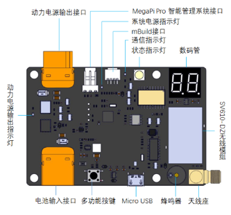

:mod:`power_manage_module` --- 电源管理模块
=============================================

.. module:: power_manage_module
    :synopsis: 源管理模块

``power_manage_module`` 模块的主要功能与函数

电源管理模块说明
----------------------

电源管理模块外观如下图所示：

功能相关函数
----------------------

.. function:: is_auto_mode()

   判断比赛是否处于自动赛模式，返回值是布尔值，其中 ``True`` 表示比赛处于自动赛模式， ``False`` 表示比赛处于手动赛模式

程序示例：
----------------------

.. code-block:: python

  import novapi
  from mbuild import power_manage_module

  while True:
      if power_manage_module.is_auto_mode():
          print("Competition is in auto mode")
      else:
          print("Competition is in manual mode")