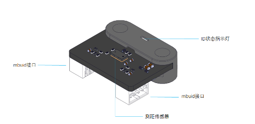

:mod:`ranging_sensor` --- 激光测距模块
=============================================

.. module:: ranging_sensor
    :synopsis: 激光测距模块

``ranging_sensor`` 模块的主要功能与函数

激光测距模块说明
----------------------

激光测距模块模块外观如下图所示：

功能相关函数
----------------------

.. function:: get_distance()

   获取超声波传感器测量的前方障碍物的距离，单位是 ``厘米``，返回的数据是浮点类型数值。 测量的范围是 ``2 ~ 200`` 厘米，2厘米以内的测量数据会不准确，当实际距离小于2cm或者大于200cm时，获取到的数据都是200。

程序示例：
----------------------

.. code-block:: python

  import novapi
  from mbuild.ranging_sensor import ranging_sensor_class

  #先初始化，定义激光测距模块接在PORT1口的第1个
  __ranging_sensor_1 = ranging_sensor_class("PORT1", "INDEX1")

  while True:
    centimeter = __ranging_sensor_1.get_distance()
    print("centimeter1: ", centimeter)
    time.sleep(1