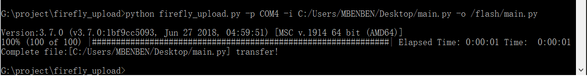

.. _tutorial_micropython_add_files:

添加自定义类库或者代码文件
======================================

如何将自己编写的一些Python脚本，或者python的类库添加到固件中。

使用mblock5软件
-------------------------

可以下载和使用 mblock5 来进行python程序的编写以及程序的上传。

.. image:: img/4.png

1. 如上图所示，打开mblock5软件后，连接好设备，并确定当前模式是 上传模式。
2. 确定当前是 python 模式(默认是积木模式)
3. 在代码编辑区编写自己的执行代码
4. 点击 ``上传到设备`` 将代码烧录进小程。

使用firefly_upload脚本
-------------------------

可以下载和使用 firefly_upload 这个python脚本来进行python程序的上传。它除了可以上传 main.py, 也可以上传第三方或者自定义的类库以供 main.py调用。

下载地址: https://github.com/YanMinge/firefly_upload

1. 下载脚本，该脚本可以支持 python2 和 python3 环境下的使用。
2. 因为上传会使用到串口，所以需要安装 pyserial 的库，最好是用 pip 安装 ``pip install pyserial``
3. 因为上传使用了一个进度条的工具，所以需要安装 progressbar2 的库，最好是用 pip 安装 ``pip install progressbar2``
4. 在 shell 或者 cmd 界面 输入 在shell 中输入 python firefly_upload.py -p [串口名称] -i [文件的路径] -o [文件烧入flash的路径]
   如windows示例: ``python firefly_upload.py -p COM5 -i C:/Users/MBENBEN/Desktop/test/main.py -o /flash/main.py``

