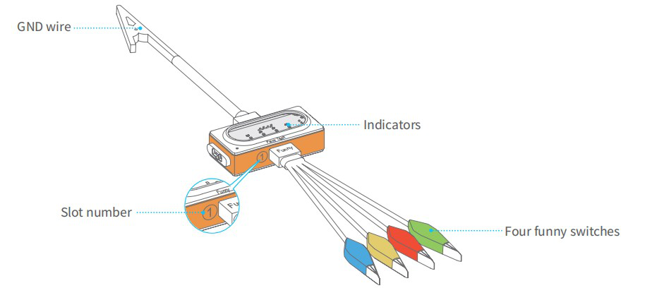

:mod:`funny_touch` --- 触摸开关(四控)模块
=============================================

.. module:: funny_touch
    :synopsis: 触摸开关(四控)模块

``funny_touch`` 模块的主要功能与函数

触摸开关(四控)使用说明
----------------------

触摸开关可以连接导电的物品（如香蕉、水），将它变成触摸开关。通过检测四色鳄鱼夹和地线的导通状态，实现简单有趣的交互效果。

如何使用：

1. 将四色鳄鱼夹插到插槽 1，地线插到插槽 2。

2. 用鳄鱼夹夹住一个导电物体。

3. 抓住地线的金属夹子，同时用另一只手触摸导电物体，触摸开关相应指示灯亮起，模块将发出一个触发信号。

注：鳄鱼夹比较锋利，请不要用四色鳄鱼夹或地线夹子夹自己或他人，否则可能会造成伤害。

功能相关函数
----------------------

.. function:: is_red_touched()

   四色鳄鱼夹的红色鳄鱼夹是否有被触摸（或者间接触摸），返回的结果是 ``True``：被触摸了， 或者 ``False``: 未被触摸。

.. function:: is_green_touched()

   四色鳄鱼夹的绿色鳄鱼夹是否有被触摸（或者间接触摸），返回的结果是 ``True``：被触摸了， 或者 ``False``: 未被触摸。

.. function:: is_yellow_touched()

   四色鳄鱼夹的黄色鳄鱼夹是否有被触摸（或者间接触摸），返回的结果是 ``True``：被触摸了， 或者 ``False``: 未被触摸。

.. function:: is_blue_touched()

   四色鳄鱼夹的蓝色鳄鱼夹是否有被触摸（或者间接触摸），返回的结果是 ``True``：被触摸了， 或者 ``False``: 未被触摸。

程序示例：
------------

.. code-block:: python

  import codey
  import time
  import event
  import neurons
  
  @event.start
  def start_cb():
      while True:
          if neurons.funny_touch.is_blue_touched():
              print("blue touched")
          if neurons.funny_touch.is_red_touched():
              print("red touched")
          if neurons.funny_touch.is_green_touched():
              print("green touched")
          if neurons.funny_touch.is_yellow_touched():
              print("yellow touched")
          
          time.sleep(0.1)
