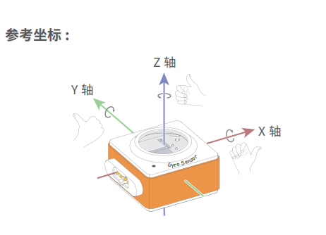

:mod:`gyro_sensor` --- 陀螺仪传感器
=============================================

.. module:: gyro_sensor
    :synopsis: 陀螺仪传感器

``gyro_sensor`` 模块的主要功能与函数

陀螺仪传感器说明
----------------------

神经元模块的陀螺仪的坐标体系如下图所示：

功能相关函数
----------------------

.. function:: get_roll()

   获取姿态角的翻滚角，返回的数据范围是 ``-90 ~ 90``

.. function:: get_pitch()

   获取姿态角的俯仰角，返回的数据范围是 ``-180 ~ 180``

.. function:: get_yaw()

   获取姿态角的偏航角，返回的数据范围是 ``-32768 ~ 32767``，由于板载的陀螺仪模块是六轴传感器，没有电子罗盘。 所以实际上偏航角只是使用了Z轴角速度的积分。它存在着积累误差。如果是想获得真实偏航角的，这个API不适合使用。

.. function:: is_shaked()

   检测神经元的陀螺仪模块是否有被摇晃，返回值是布尔值，其中 ``True`` 表示陀螺仪模块被晃动了，``False`` 表示陀螺仪模块未被晃动。

.. function:: get_acceleration(axis)

   获取三个轴的加速度值，单位是 ``g``，参数：

    - *axis* 字符串类型，以 ``x``，``y``，``z`` 代表陀螺仪模块定义的坐标轴。

.. function:: get_gyroscope(axis)

   获取三个轴的角速度值，单位是 ``°/秒``，参数：

    - *axis* 字符串类型，以 ``x``，``y``，``z`` 代表陀螺仪模块定义的坐标轴。

程序示例1：
------------

.. code-block:: python

  import rocky
  import event
  import neurons
  
  @event.button_a_pressed
  def on_button_a_callback():
      codey.stop_other_scripts()
      codey.display.show("pit")
      while True:
          print(neurons.gyro_sensor.get_pitch())
          time.sleep(0.05)
  
  @event.button_b_pressed
  def on_button_b_callback():
      codey.stop_other_scripts()
      codey.display.show("rol")
      while True:
          print(neurons.gyro_sensor.get_roll())
          time.sleep(0.05)
  
  @event.button_c_pressed
  def on_button_c_callback():
      codey.stop_other_scripts()
      codey.display.show("yaw")
      while True:
          print(neurons.gyro_sensor.get_yaw())
          time.sleep(0.05)

程序示例2：
------------

.. code-block:: python

  import rocky
  import event
  import neurons
  
  @event.start
  def start_cb():
      codey.display.show("sha")
      while True:
          print(neurons.gyro_sensor.is_shaked())
          time.sleep(0.2)

程序示例3：
------------

.. code-block:: python

  import rocky
  import event
  import neurons
  
  @event.start
  def start_cb():
      while True:
          print("gyro z:", end = "")
          print(neurons.gyro_sensor.get_gyroscope("z"))
          print("accel z:", end = "")
          print(neurons.gyro_sensor.get_acceleration("z"))
          time.sleep(0.2)