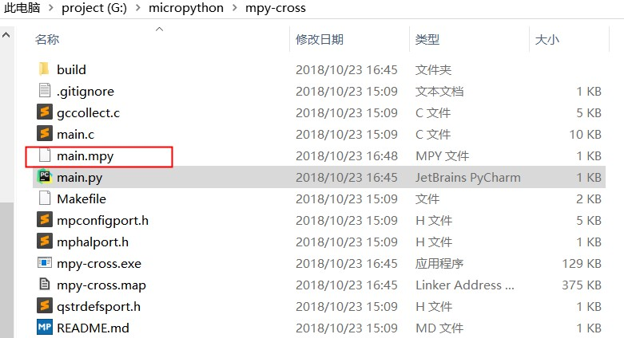

.. _tutorial_micropython_mpy:

[MicroPython]使用mpy-cross工具生成mpy文件
========================================================

版权声明：翻译整理属于makeblock，转载时请以超链接形式标明文章原始出处和作者信息及本声明

接触过Python语言的人都知道，Python可以编译成.pyc文件，它是一种二进制文件，可以提高程序的加载速度，同时也是一种保护源代码的有效方法。 在micropython中，也提供了类似的功能，可以将.py文件编译成.mpy文件。接下来，介绍一下具体的实现步骤。（本文以 mingw32 工具链为例）

搭建micropython编译环境
-------------------------
** 注意：**
1. 在不同的系统环境以及不同的目标主板，micropython的开发环境安装是有差别的，这里仅以乐鑫esp32的mingw32工具链作为示意。
2. 对于乐鑫的工具链，我们是需要用到它的 ``xtensa-esp32-elf``

1. 参考乐鑫 `设置工具链 <https://docs.espressif.com/projects/esp-idf/en/stable/get-started/#setup-toolchain>`_，以 windows系统为例，可以从乐鑫的官网下载 `Windows all-in-one工具链 & MSYS2 zip包 <https://dl.espressif.com/dl/esp32_win32_msys2_environment_and_toolchain-20180110.zip>`_，将zip文件解压缩到C盘的根目录（也可以是其他一些位置，但本文档假定为 ``C:\``  ），它将创建一个带有预先准备好的环境的msys32目录。

2.下载micropython源码包到本地，我下载到了G盘的根目录下。

.. code-block::

  git clone --recursive https://github.com/micropython/micropython.git

生成mpy文件
-------------------------
3.执行msys32目录中的 ``mingw32.exe`` 切换到 /g/micropython/mpy-cross目录执行make，编译生成mpy-cross工具。

.. code-block::

  make

.. image::img/1.png

.. image::img/2.png

4.在mpy-cross目录新建一下main.py文件，以小程为例，写一个测试程序用于验证。
 
.. code-block:: python
 
  import codey
  import time
  
  codey.led.show(2555,255,255)
  time.sleep(2)
  codey.led.off()
  time.sleep(2)
  while True:
      codey.led.set_red(255)
      time.sleep(1)
      codey.led.set_green(255)
      time.sleep(1)
      codey.led.set_blue(255)
      time.sleep(1)
      codey.led.off()
      time.sleep(1)

5.执行编译mpy文件的命令。

.. code-block::

  ./mpy-cross main.py

其他相关功能可查看同目录下的README.md文件。

6.命令执行成功后，你就能发现同目录下出现了一个test.mpy文件。

7.将 main.mpy 文件拷贝放到小程的flash中，如果是 main文件名的话，小程会自动运行。
  烧录 *.py 或者 *.mpy 文件的说明见

.. toctree::
  :maxdepth: 1

  ../../tutorial/add_files.rst

** 注意：** 
如果运行时出现“ValueError: invalid .mpy file”错误的话，需要更新一下主板的micropython固件(最新固件跟随mblock最新版本发布)。
