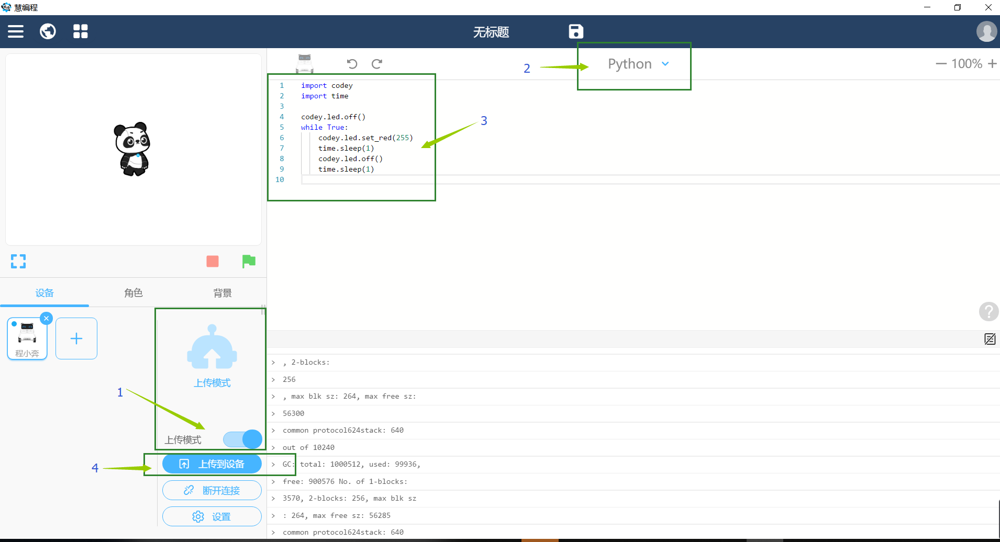

.. _tutorial_micropython_mpy:

[MicroPython]使用mpy-cross工具生成mpy文件
========================================================

版权声明：翻译整理属于makeblock，转载时请以超链接形式标明文章原始出处和作者信息及本声明

接触过Python语言的人都知道，Python可以编译成.pyc文件，它是一种二进制文件，可以提高程序的加载速度，同时也是一种保护源代码的有效方法。 在micropython中，也提供了类似的功能，可以将.py文件编译成.mpy文件。接下来，介绍一下具体的实现步骤。（本文以 mingw32 工具链为例）

搭建micropython编译环境
-------------------------
注: 在不同的系统环境以及不同的目标主板，micropython的开发环境安装是有差别的，这里仅以esp32的 mingw32 工具链作为示意。

1. 参考乐鑫 `设置工具链 <https://docs.espressif.com/projects/esp-idf/en/stable/get-started/#setup-toolchain>`_，以 windows系统为例，可以从乐鑫的官网下载 `Windows all-in-one工具链 & MSYS2 zip包 <https://dl.espressif.com/dl/esp32_win32_msys2_environment_and_toolchain-20180110.zip>`_，将zip文件解压缩到C盘的根目录（也可以是其他一些位置，但本文档假定为 ``C:\``  ），它将创建一个带有预先准备好的环境的msys32目录。

2.下载micropython源码包到本地，我下载到了home目录下。

.. code-block::

  git clone --recursive https://github.com/micropython/micropython.git

生成mpy文件
-------------------------
3.切换到/home/micropython/mpy-cross目录执行make，编译生成mpy-cross工具。

.. code-block::

  make

.. image::img/1.png

.. image::img/2.png

4.在mpy-cross目录新建一下test.py文件，输入点亮小程的LED，用于测试。
 
.. code-block:: python
 
   import codey

   codey.led.show(2555,255,255)

5.执行编译mpy文件的命令。

.. code-block::

  ./mpy-cross test.py

其他相关功能可查看同目录下的README.md文件。

6.命令执行成功后，你就能发现同目录下出现了一个test.mpy文件。

.. image:: img/3.png

7.将test.mpy文件拷贝放到小程的flash中，直接在main.py中import即可。

.. code-block:: python

    import test

  
8.重启小程使其重新运行程序(用mblock烧录的话，会自动软重启)，大家就会看到小程的LED灯亮起来了。

** 注意：** ::

 如果运行时出现“ValueError: invalid .mpy file”错误的话，需要更新一下程小奔的micropython固件(最新版本是1.9.4)。
 虽然是进行了加密编译成了mpy文件，但是还有一些缺陷，毕竟mpy文件仍然是存放在 FLASH 或 TF 卡中，很容易被别人拷贝，也很有可能会被反编译出来。
